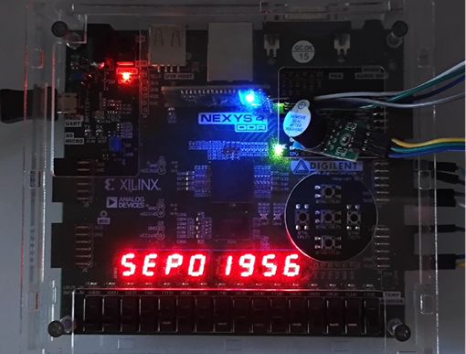

# Smart-Combination-Lock

 

A smart combination lock system has been designed and implemented to enhance security through encryption-supported password management and user feedback mechanisms. The system architecture supports functionalities such as password input, password verification, encrypted storage, anti-brute force protection, and alarm triggering via both sound and Bluetooth. The methodology includes detailed hardware design, VHDL module block diagrams, and an ASM Chart that defines the state transitions between $lock$, $unlock$, $set\_pwd$, and $check\_pwd$ states. Key modules, including segment display, timer, button debounce, buzzer, Bluetooth, encrypt, and decrypt, are discussed with critical code segments highlighted to demonstrate modularity and system integration. Simulation and real-world testing, performed through some dedicated testbench, validate the system’s functionality and robustness. Results indicate that the smart combination lock operates reliably, with accurate password verification and effective alarm triggering in response to unauthorized attempts. This work demonstrates the feasibility of implementing a secure and interactive locking mechanism using a modular, hardware-based approach.